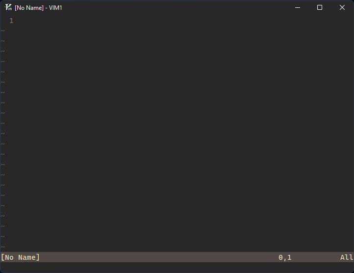

# wincap.vim

Customize the gvim window caption color to match your vim colorscheme on Windows 11.



## Install

**Minimal OS version: `Windows 10.0.22000` (Windows 11)**

```
Plug 'stillwwater/wincap.vim'
```

## Options

```vim
let g:wincap_color = ''  " Override color (ex. 1C1C1C)
let g:wincap_vim_exe = 'gvim.exe'
let g:wincap_plugin_exe = g:plug_home . '\wincap.vim\bin\wincap.exe'
```
